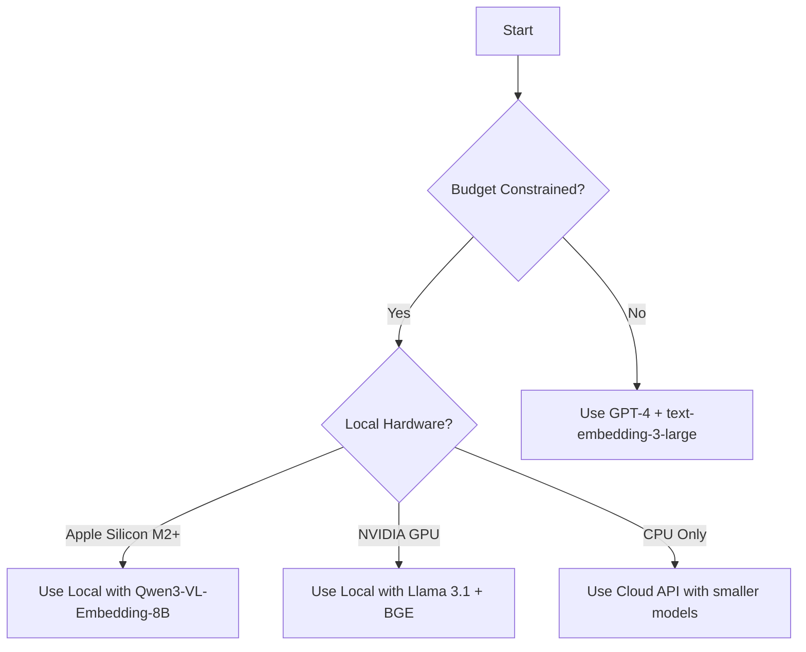

# Model Configuration

DeepTutor supports a variety of language models and embedding models for different use cases.

## Supported LLM Providers

### Cloud Providers

| Provider | Models | Best For |
|----------|--------|----------|
| OpenAI | GPT-4, GPT-4 Turbo, GPT-3.5 Turbo | General use, high quality |
| Anthropic | Claude 3 Opus, Sonnet, Haiku | Long context, safety |
| Google | Gemini Pro, Gemini Ultra | Multimodal tasks |

### Local Models

| Model | Parameters | VRAM Required | Notes |
|-------|------------|---------------|-------|
| Llama 3.1 8B | 8B | 8 GB | Good balance of speed/quality |
| Llama 3.1 70B | 70B | 40 GB+ | High quality, slower |
| Mistral 7B | 7B | 6 GB | Fast inference |
| Qwen2 7B | 7B | 6 GB | Excellent multilingual |

## Embedding Models

### Cloud Embeddings

| Model | Dimensions | Cost | Quality |
|-------|------------|------|---------|
| `text-embedding-3-large` | 3072 | $$ | Excellent |
| `text-embedding-3-small` | 1536 | $ | Good |
| `text-embedding-ada-002` | 1536 | $ | Good (legacy) |

### Local Embeddings

| Model | Dimensions | Memory | Notes |
|-------|------------|--------|-------|
| `Qwen3-VL-Embedding-8B` | 4096 | 16 GB | **Recommended** - Best quality |
| `ColQwen2` | 128 | 4 GB | Efficient, good for retrieval |
| `bge-large-en-v1.5` | 1024 | 2 GB | Fast, English-focused |
| `e5-large-v2` | 1024 | 2 GB | Balanced option |

See [Research: Embedding Model Comparison](../research/embedding-models.md) for detailed benchmarks.

## Configuration Examples

### High Quality (Cloud)

```yaml
# config/models.yaml
llm:
  provider: openai
  model: gpt-4-turbo
  temperature: 0.7
  max_tokens: 4096

embedding:
  provider: openai
  model: text-embedding-3-large
  dimensions: 3072
```

### Cost Optimized (Cloud)

```yaml
# config/models.yaml
llm:
  provider: openai
  model: gpt-3.5-turbo
  temperature: 0.7
  max_tokens: 2048

embedding:
  provider: openai
  model: text-embedding-3-small
  dimensions: 1536
```

### Local Deployment (Apple Silicon)

```yaml
# config/models.yaml
llm:
  provider: local
  model: llama-3.1-8b
  device: mps
  quantization: 4bit

embedding:
  provider: local
  model: Qwen3-VL-Embedding-8B
  device: mps
  batch_size: 4
```

## Model Selection Guide


