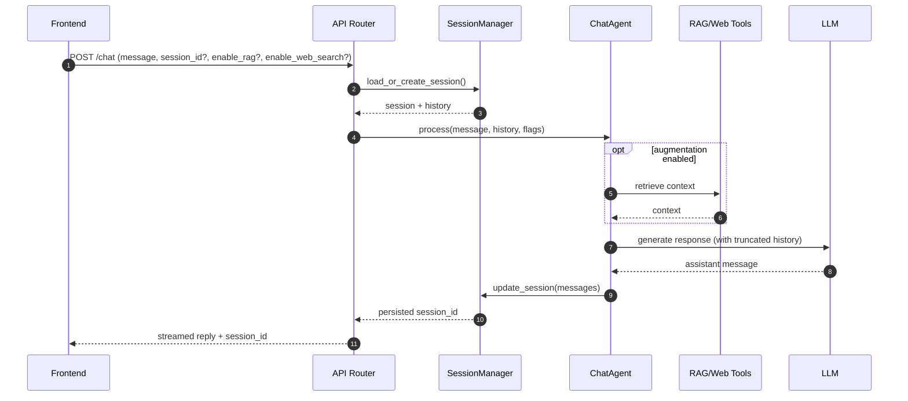

# Chat Workflow

**Goal:** provide a lightweight multi-turn conversational interface with optional augmentation and persistent session history.

**Key entrypoints**
- API: `src/api/routers/chat.py`
- Agent: `src/agents/chat/chat_agent.py`
- Sessions: `src/agents/chat/session_manager.py`

## Flow

```mermaid
flowchart TD
  U[User message] --> API[FastAPI /chat]
  API --> SM[SessionManager\n(load/create session)]
  SM --> CA[ChatAgent\n(history + config)]
  CA --> AUG{Augment?}
  AUG -->|RAG| RAG[RAG retrieve]
  AUG -->|Web| WEB[Web search]
  AUG -->|None| LLM[LLM response]
  RAG --> LLM
  WEB --> LLM
  LLM --> SAVE[Persist session]
  SAVE --> OUT[Streamed reply]
```

## Sequence



## Notes

- The chat workflow is optimized for **low-latency** turns; history is truncated to stay within token limits.
- Session state is persisted so the UI can present “recent chats” and allow resuming.
