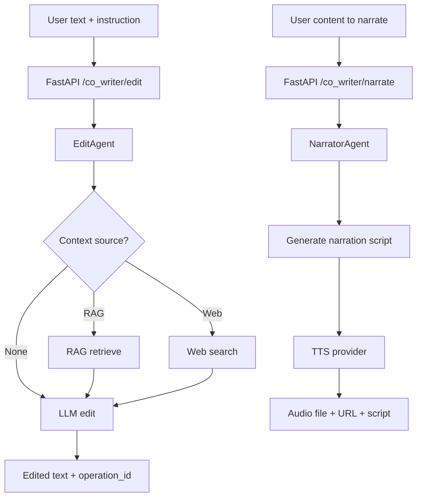
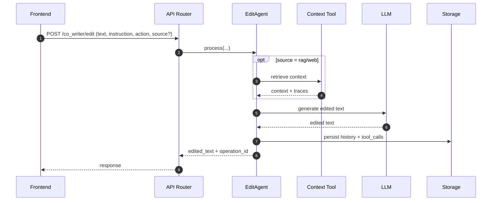

# Co-Writer Workflow

**Goal:** help users revise text (optionally with context) and optionally generate narration + TTS audio.

**Key entrypoints**
- API: `src/api/routers/co_writer.py`
- Agents: `src/agents/co_writer/edit_agent.py`, `src/agents/co_writer/narrator_agent.py`

## Flow

## Sequence (Edit)

## Notes

- Co-Writer persists edit/narration history under `data/user/co-writer/`.
- Narration splits into **script generation** (LLM) and **audio generation** (TTS provider).
