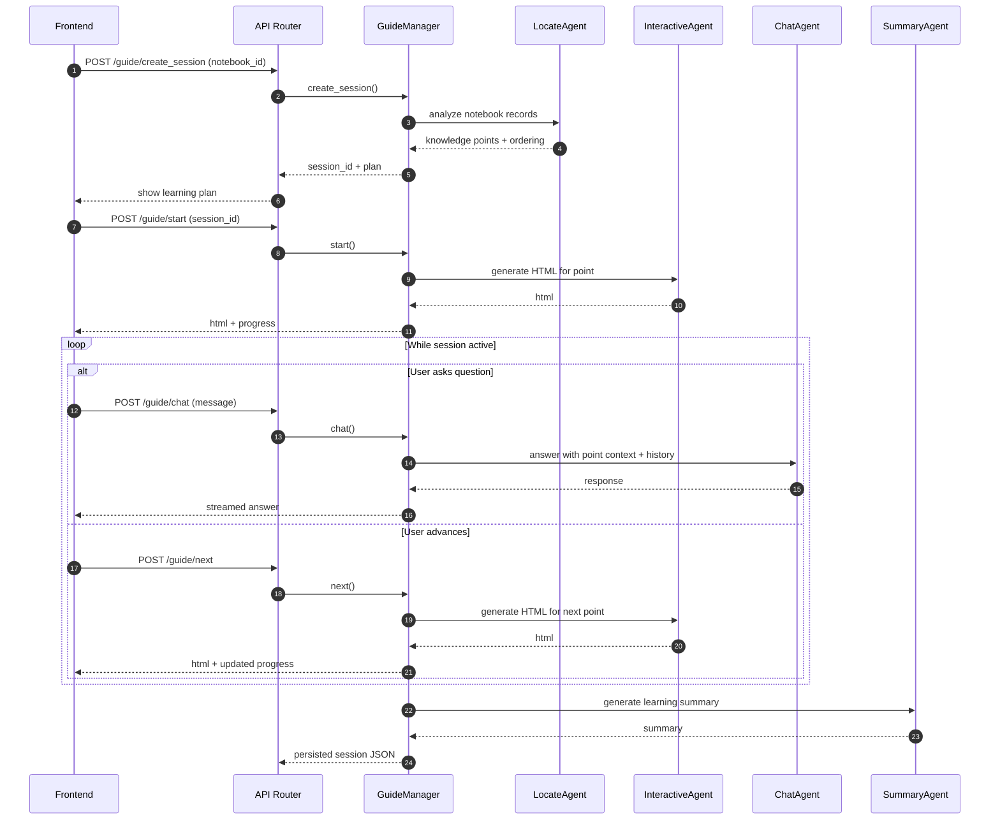

# Guide Workflow

**Goal:** build a guided learning session from notebook history, then support interactive study with context-aware chat and generated pages.

**Key entrypoints**
- API: `src/api/routers/guide.py`
- Session manager: `src/agents/guide/guide_manager.py`
- Agents: `src/agents/guide/agents/`

## Flow

```mermaid
flowchart TD
  U[User selects notebook] --> API[FastAPI /guide]
  API --> GM[GuideManager]
  GM --> LOC[LocateAgent\n(extract knowledge points)]
  LOC --> PLAN[Learning plan\n(3-5 points)]
  PLAN --> INT[InteractiveAgent\n(generate HTML page)]
  INT --> LOOP{Study loop}
  LOOP -->|Ask| CHAT[ChatAgent\n(context Q&A)]
  LOOP -->|Next| INT
  LOOP -->|Complete| SUM[SummaryAgent]
  SUM --> OUT[Session JSON + summary]
```

## Sequence



## Notes

- The guide workflow is **stateful**: progress and history persist per session in `user/guide/`.
- HTML generation includes a “fix HTML” path for iterative repair when the generated page is invalid.
