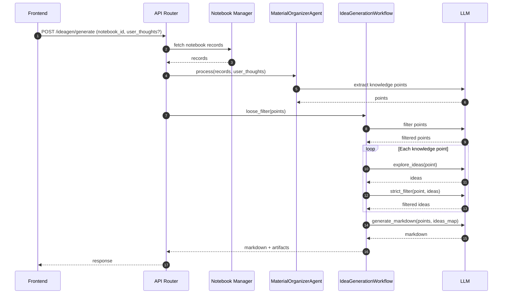

# IdeaGen Workflow

**Goal:** extract knowledge points from notebook records and generate high-quality research ideas through staged filtering.

**Key entrypoints**
- API: `src/api/routers/ideagen.py`
- Orchestrator: `src/agents/ideagen/idea_generation_workflow.py`
- Extractor: `src/agents/ideagen/material_organizer_agent.py`

## Flow

```mermaid
flowchart TD
  U[User selects notebook] --> API[FastAPI /ideagen/generate]
  API --> REC[Load notebook records]
  REC --> MO[MaterialOrganizerAgent\n(extract knowledge points)]
  MO --> LF[Loose filter\n(remove unsuitable points)]
  LF --> EI[Explore ideas\n(>=5 per point)]
  EI --> SF[Strict filter\n(keep >=1, remove >=2)]
  SF --> MD[Generate markdown\n(structured output)]
  MD --> OUT[Ideas markdown + JSON artifacts]
```

## Sequence



## Notes

- The staged filters enforce a **quality bar** while guaranteeing at least one idea per retained knowledge point.
- IdeaGen is notebook-driven: the quality of notebook records strongly affects the output.
