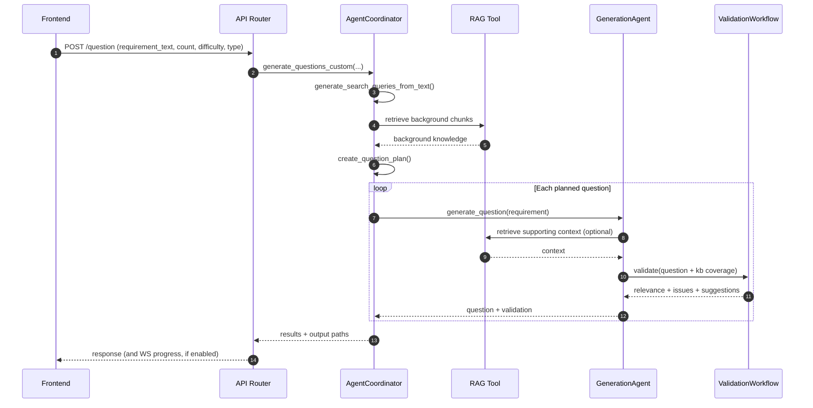

# Question Generation Workflow

**Goal:** generate practice questions either from a knowledge base (custom mode) or by mimicking a reference exam (mimic mode).

**Key entrypoints**
- API: `src/api/routers/question.py`
- Coordinator: `src/agents/question/coordinator.py`
- Validation: `src/agents/question/validation_workflow.py`
- Mimic tool: `src/agents/question/tools/exam_mimic.py`

## Flow

```mermaid
flowchart TD
  U[User request] --> API[FastAPI /question]
  API --> C[AgentCoordinator]
  C --> MODE{Mode?}

  MODE -->|Custom| Q1[Generate RAG queries]
  Q1 --> BK[Retrieve background knowledge]
  BK --> PLAN[Create question plan]
  PLAN --> LOOP[For each question]
  LOOP --> GA[GenerationAgent]
  GA --> VW[ValidationWorkflow\n(single-pass)]
  VW --> SAVE1[Persist results\n(JSON per question)]

  MODE -->|Mimic| PDF[Parse PDF / MinerU]
  PDF --> EXT[Extract reference questions]
  EXT --> LOOP2[For each reference question]
  LOOP2 --> GA2[GenerationAgent]
  GA2 --> VW2[ValidationWorkflow]
  VW2 --> SAVE2[Persist mimic outputs\n(folder + JSON)]
```

## Sequence (Custom Mode)



## Notes

- Validation is designed as **single-pass** analysis (“approve” with diagnostics) to maximize throughput and reduce rejection loops.
- Mimic mode adds a **document parsing/extraction** stage before generation.
