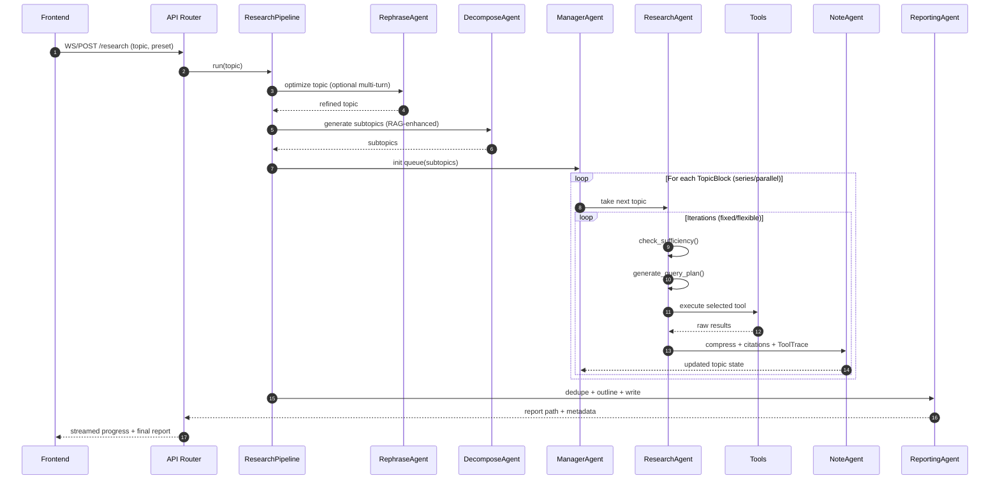

# Research Workflow

**Goal:** turn a broad topic into a structured report using a three-phase pipeline and a dynamic topic queue.

**Key entrypoints**
- API: `src/api/routers/research.py`
- Orchestrator: `src/agents/research/research_pipeline.py`
- Agents: `src/agents/research/agents/`

## Flow

```mermaid
flowchart TD
  U[User topic] --> API[FastAPI /research]
  API --> RP[ResearchPipeline]

  subgraph P1[Phase 1: Planning]
    RE[RephraseAgent\n(topic refine)] --> DE[DecomposeAgent\n(subtopics)]
    DE --> Q[DynamicTopicQueue\n(TopicBlocks)]
  end

  subgraph P2[Phase 2: Researching]
    M[ManagerAgent\n(schedule next topic)] --> RA[ResearchAgent\n(sufficiency + query plan)]
    RA --> TOOL[Tools\n(RAG/Web/Paper/Code)]
    TOOL --> NA[NoteAgent\n(compress + ToolTrace)]
    NA --> M
  end

  subgraph P3[Phase 3: Reporting]
    REP[ReportingAgent\n(outline + write)] --> OUT[Markdown report\n(with citations)]
  end

  RP --> P1 --> P2 --> P3
```

## Sequence



## Notes

- The dynamic queue supports **discovery** (new subtopics) and **scheduling** (series vs parallel).
- Reporting intentionally happens after research to avoid “premature narrative lock-in.”
